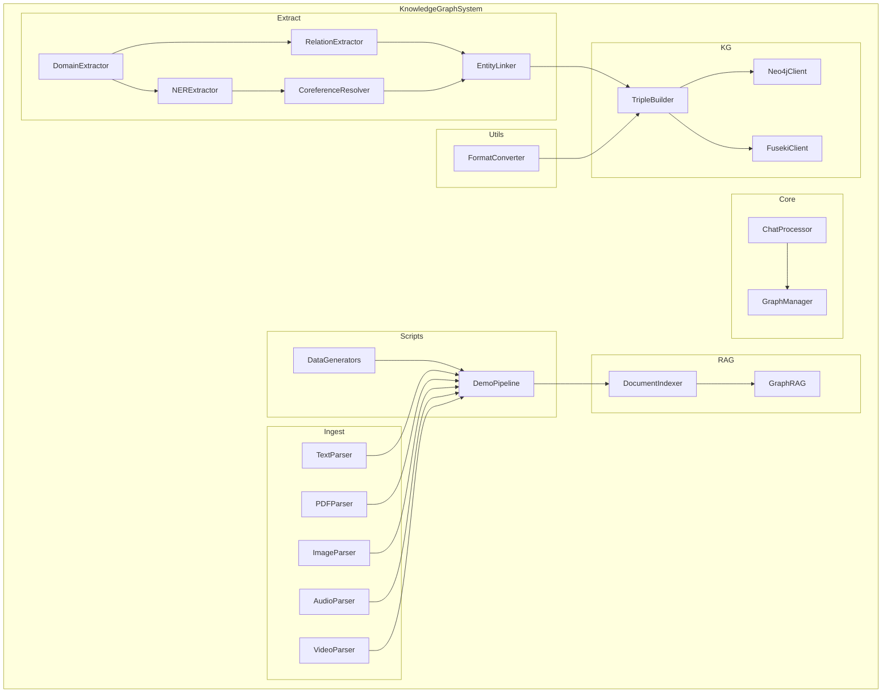

    

    <b>Automatic Architecture Diagrams from Code</b> 
    <a href="https://github.com/swark-io/swark">GitHub</a> • <a href="https://swark.io">Website</a> • <a href="mailto:contact@swark.io">Contact Us</a>

## Usage Instructions

1. **Render the Diagram**: Use the links below to open it in Mermaid Live Editor, or install the [Mermaid Support](https://marketplace.visualstudio.com/items?itemName=bierner.markdown-mermaid) extension.
2. **Recommended Model**: If available for you, use `claude-3.5-sonnet` [language model](vscode://settings/swark.languageModel). It can process more files and generates better diagrams.
3. **Iterate for Best Results**: Language models are non-deterministic. Generate the diagram multiple times and choose the best result.

## Generated Content
**Model**: GPT-4o - [Change Model](vscode://settings/swark.languageModel)  
**Mermaid Live Editor**: [View](https://mermaid.live/view#pako:eNqNlE1z2yAQhv-KhnNy68mHztj6sBV_RJHUXlAPVKxlGgQeQK09mfz3Ykim-sqkOvHwLu-yy45eUC0poAWqRKPI-RSUUSUC--nup9_YCvmHA21gfcPiqg20PmQQFkoF_7Zv3xKHJ2IyJWvQWqofQ3WFnd-eCNJAXwRBZ-zji1GkNkOPEEeyJUy8iZMcET7E-UdijHPgxDD54fEE34o6ggJRQw5a8t8wjlnjWBhmrjsmnv-jjO16eHyDS8XOHFYd43RinuIDyC-_Qs5AmJH2gJNOwzObiPOJi9rmMXroscURMWQNAhSx5etRih2OoJUZOwNnAj5NkYoG9OiF9riEi8mI0pPiDjiLklnlEaetHYpZLcPLjjI5qz3h74zCVJu_br4cvUVup6nuWtvNVFC4TOwLP7H23Kfe3wzjo16XOJGqJSaUwk6Rmb-gW_jlMri__xqsPIQOoj7EHiIHiYfYwVtZSR_WDjYeNg7SPjx42DrYedj34dCHxz5kfXjqw85B7iF3UHgo36-D7lALti2M2l_QS4XMCVqo0CKoEIUj6bip0KsN6s6UGIgYsf1t0cKoDu4Q6YwsrqJ-ZyW75oQWR8I1vP4F-exUHw) | [Edit](https://mermaid.live/edit#pako:eNqNlE1z2yAQhv-KhnNy68mHztj6sBV_RJHUXlAPVKxlGgQeQK09mfz3Ykim-sqkOvHwLu-yy45eUC0poAWqRKPI-RSUUSUC--nup9_YCvmHA21gfcPiqg20PmQQFkoF_7Zv3xKHJ2IyJWvQWqofQ3WFnd-eCNJAXwRBZ-zji1GkNkOPEEeyJUy8iZMcET7E-UdijHPgxDD54fEE34o6ggJRQw5a8t8wjlnjWBhmrjsmnv-jjO16eHyDS8XOHFYd43RinuIDyC-_Qs5AmJH2gJNOwzObiPOJi9rmMXroscURMWQNAhSx5etRih2OoJUZOwNnAj5NkYoG9OiF9riEi8mI0pPiDjiLklnlEaetHYpZLcPLjjI5qz3h74zCVJu_br4cvUVup6nuWtvNVFC4TOwLP7H23Kfe3wzjo16XOJGqJSaUwk6Rmb-gW_jlMri__xqsPIQOoj7EHiIHiYfYwVtZSR_WDjYeNg7SPjx42DrYedj34dCHxz5kfXjqw85B7iF3UHgo36-D7lALti2M2l_QS4XMCVqo0CKoEIUj6bip0KsN6s6UGIgYsf1t0cKoDu4Q6YwsrqJ-ZyW75oQWR8I1vP4F-exUHw)

